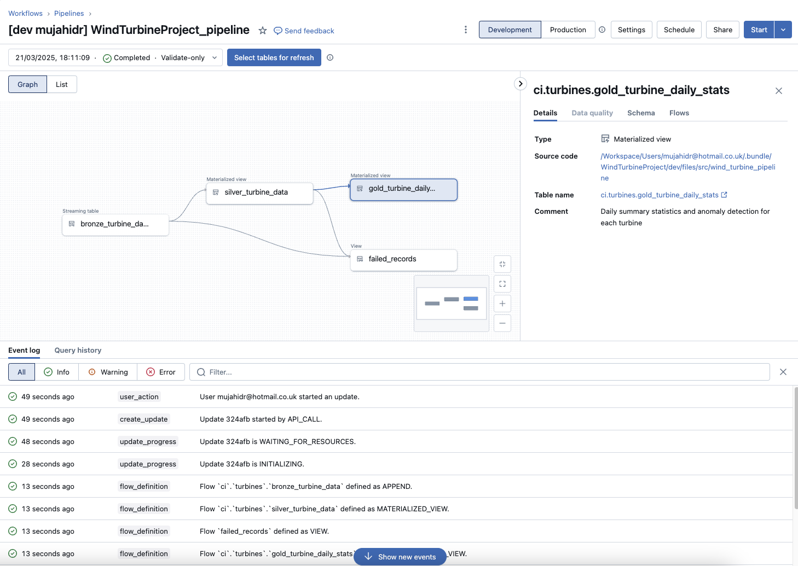

# Wind Turbine Data Pipeline

A robust data pipeline for processing and analyzing wind turbine performance data using Apache Spark and Delta Live Tables (DLT).

## Project Overview

This project implements a modern data lakehouse architecture with three layers:

- **Bronze Layer**: Raw data ingestion from CSV files
- **Silver Layer**: Validated and cleaned data with quality checks
- **Gold Layer**: Daily aggregations and anomaly detection

### Key Features

- Streaming data ingestion from CSV files
- Comprehensive data quality validation
- Anomaly detection in turbine performance
- Daily performance metrics
- Failed record tracking and monitoring

## Pipeline Architecture



*A visual representation of our data pipeline architecture showing data flow and transformations.*

## Architecture

```
Raw CSV Files
     ↓
Bronze Layer (bronze_turbine_data)
     ↓
Silver Layer (silver_turbine_data) ──→ Failed Records View
     ↓
Gold Layer (gold_turbine_daily_stats)
```

## Data Quality Rules

The pipeline implements robust data validation in the silver layer:

- **Timestamp Validation**: Ensures non-null timestamps
- **Turbine ID Validation**: Verifies turbine identifier presence
- **Power Output**: Must be non-negative
- **Wind Speed**: Must be between 0 and 40 m/s
- **Wind Direction**: Must be between 0 and 360 degrees

## Project Structure

```
WindTurbineProject/
├── src/
│   ├── tasks/
│   │   ├── common.py      # Data quality rules and utilities
│   │   └── gold.py        # Gold layer transformations
│   └── wind_turbine_pipeline.py  # Main pipeline definition
├── test/
│   ├── test_gold.py       # Gold layer unit tests
│   └── test_common.py     # Data quality validation tests
└── README.md
```

## Testing

The project includes comprehensive unit tests for both data transformations and quality rules:

### Gold Layer Tests (`test_gold.py`)
- Daily aggregation validation
- Anomaly detection testing
- Statistical calculations verification

Run tests using:
```bash
pytest WindTurbineProject/test/
```

## Requirements

- Apache Spark 3.x
- Python 3.x
- PySpark
- Delta Live Tables
- pytest (for running tests)

## Setup and Installation

1. Clone the repository
2. Configure your Databricks workspace
3. Set up the input path for raw CSV files
4. Deploy the DLT pipeline

## Pipeline Components

### Bronze Layer
- Raw data ingestion
- Schema enforcement
- Metadata tracking

### Silver Layer
- Data quality validation
- Failed record tracking
- Business rule enforcement

### Gold Layer
- Daily statistics calculation
- Anomaly detection
- Performance metrics

